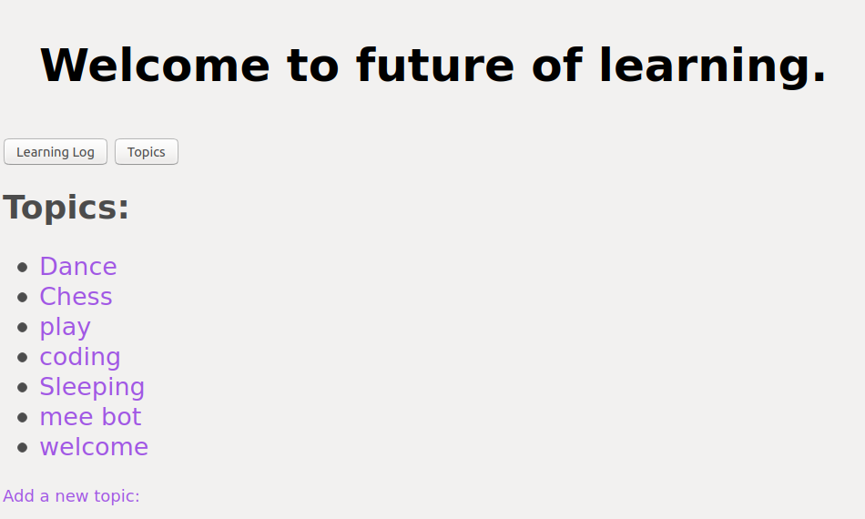
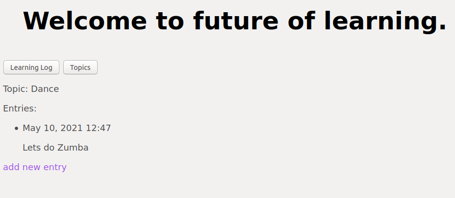
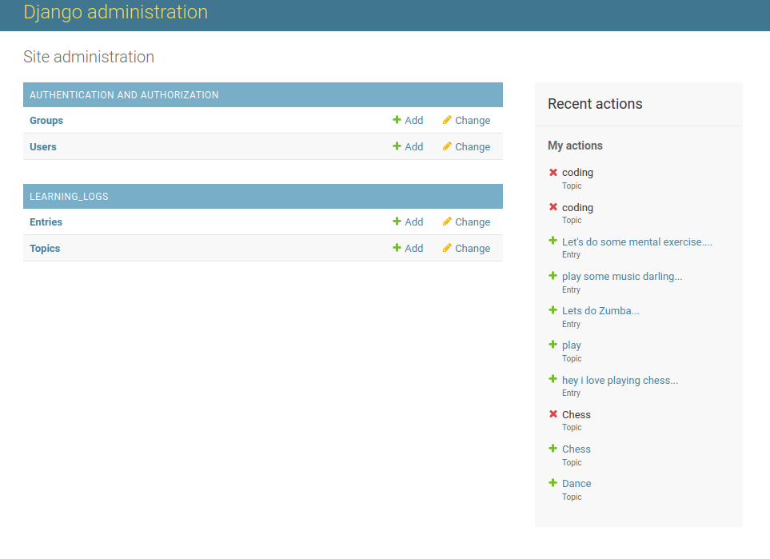

# Learning Log
#### Developed with :heart: and :coffee: by @Ayush-SR

<b> Learning Log </b> helps you keep track of your learning, for any topic you're learning about.

<blockquote style="color:darksalmon; background-color:black; text-align: center; border-radius: 50px;
font-size: 15px; font-weight: 100;">" Live as if you were to die tomorrow. Learn as if you were to live forever.” ~ Mahatma Gandhi </blockquote>

----------------------------------------------------------

#### Topics Page

#### Entry Page

#### Admin Page

